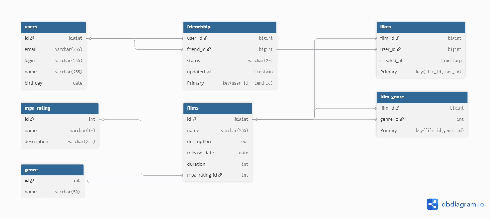

# Filmorate API

REST API для управления фильмами, пользователями, друзьями и лайками. Хранение в памяти, обмен JSON.

## Запуск

Запустите `ru.yandex.practicum.filmorate.FilmorateApplication`

Сервер стартует на `http://localhost:8080`

## Эндпоинты

### Фильмы

| Метод | Путь | Описание |
|-------|------|----------|
| GET | /films | все фильмы |
| GET | /films/{id} | фильм по ID |
| POST | /films | добавить фильм |
| PUT | /films | обновить фильм |
| PUT | /films/{id}/like/{userId} | поставить лайк |
| DELETE | /films/{id}/like/{userId} | удалить лайк |
| GET | /films/popular?count={count} | топ N фильмов по лайкам (по умолчанию 10) |

### Пользователи

| Метод | Путь | Описание |
|-------|------|----------|
| GET | /users | все пользователи |
| GET | /users/{id} | пользователь по ID |
| POST | /users | создать пользователя |
| PUT | /users | обновить пользователя |
| PUT | /users/{id}/friends/{friendId} | добавить в друзья |
| DELETE | /users/{id}/friends/{friendId} | удалить из друзей |
| GET | /users/{id}/friends | список друзей |
| GET | /users/{id}/friends/common/{otherId} | общие друзья |

## Схема базы данных

### Примеры запросов
#### 1. Все фильмы с рейтингом MPA:
```sql
SELECT
    id,
    name,
    duration,
    mpa_rating_id
FROM
    films
WHERE
    mpa_rating_id IN (
        SELECT
            id
        FROM
            mpa_rating
    );
```
#### 2. Топ 10 популярных фильмов:
```sql
SELECT
    id,
    name
FROM
    films
WHERE
    id IN (
        SELECT
            film_id
        FROM
            likes
        GROUP BY
            film_id
        ORDER BY
            COUNT(user_id) DESC
        LIMIT 10
    );
```
#### 3. Друзья пользователя (например, с id 1):
```sql
SELECT
    id,
    login,
    name
FROM
    users
WHERE
    id IN (
        SELECT
            friend_id
        FROM
            friendship
        WHERE
            user_id = 1
          AND
            status = 'confirmed'
    );
```
#### 4. Общие друзья пользователей (например, с id 1 и 2):
```sql
SELECT
    id,
    login,
    name
FROM
    users
WHERE
    id IN (
        SELECT
            friend_id
        FROM
            friendship
        WHERE
            user_id = 1
          AND
            status = 'confirmed'
    )
  AND
    id IN (
        SELECT
            friend_id
        FROM
            friendship
        WHERE
            user_id = 2
          AND
            status = 'confirmed'
    );
```
#### 5. Получить пользователя по id (например, 1):
```sql
SELECT
    id,
    email,
    login,
    name,
    birthday
FROM
    users
WHERE
    id = 1;
```

## Технологии

- Java 21
- Spring Boot 3.5
- Lombok
- Logbook (логирование HTTP запросов)

## Автор

Владислав Сакас, студент 74й когорты Java